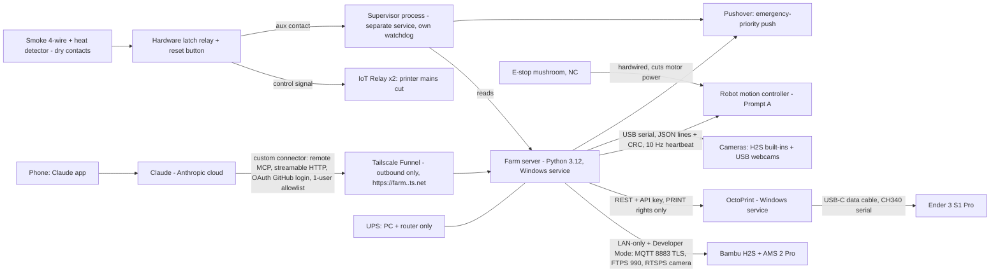

# FarmHand OS — Architecture (Phase 1, researched 2026-10-02)

Status: **Gate 1 draft.** Firmware-dependent facts are dated; re-verify on hardware day (H2S arrives 2026-10-03).

## Diagram (decided version)

## Decisions (with the numbers that decided them)

### D1 — Claude link: Tailscale Funnel + FastMCP OAuth (GitHub login, single-user allowlist)
Custom connectors are called **from Anthropic's cloud**, not from the phone, so the server needs a public HTTPS URL ([Claude help](https://support.claude.com/en/articles/11175166-get-started-with-custom-connectors-using-remote-mcp)). Anthropic's request source range is 160.79.104.0/21 (from search results citing [platform docs](https://platform.claude.com/docs/en/agents-and-tools/mcp-connector) — verify before using it as a firewall rule).

| Option | 24/7 reliability | Security | Setup | Cost | Score /15 |
|---|---|---|---|---|---|
| **Tailscale Funnel** (outbound tunnel, free `*.ts.net` HTTPS name, native Windows service) | 4 — up while PC + Tailscale service are up | 4 — no open ports; auth is ours (OAuth) | 5 — one command | free | **13** |
| Cloudflare Tunnel (`cloudflared`) + Access | 5 — mature, Windows service | 5 — can add Access + WAF; but bot rules can block Claude (test) | 3 — needs a domain on Cloudflare | ~CAD 15/yr domain | 13 (pick later if Funnel flaps) |
| Anthropic MCP tunnels | — | 5 | — | **Enterprise plan only, research preview** ([docs](https://claude.com/docs/connectors/mcp-tunnels/overview)) | ✗ not available to SP |
| Claude Code Remote Control (`claude remote-control` on the PC) | 3 — session must stay alive | **2 — Claude gets a shell on the farm PC, not a whitelist** | 4 | plan | 9 — keep for *maintenance*, never as the farm control path ([docs](https://code.claude.com/docs/en/mobile)) |
| Claude Desktop + local MCP | 2 — not reachable from phone | 4 | 4 | — | ✗ fails acceptance test 1 |

Tie-break Funnel vs Cloudflare = setup effort + no domain needed. Recipe to adapt: [mrmartineau gist](https://gist.github.com/mrmartineau/475dc3e8ffc6908f1493a05989a116ff) (FastMCP + Funnel + GitHub OAuth). Server core: [PrefectHQ/fastmcp](https://github.com/PrefectHQ/fastmcp) (Apache-2.0) for its `GitHubProvider`/OAuthProxy. Funnel only serves ports 443/8443/10000.

### D2 — Bambu H2S: LAN-only + Developer Mode, our own thin driver
- Developer Mode lives at Settings → WLAN/Network → LAN Only → Developer Mode; it opens MQTT, FTP(S), camera stream ([Bambu wiki](https://wiki.bambulab.com/en/knowledge-sharing/enable-developer-mode) — page blocked from this sandbox; confirmed via secondary sources, **verify on the printer screen day 1**).
- Latest *listed* H2S firmware: **01.02.00.00 (2026-03-31)**; a 01.03.00.00 build was pulled ([bambuhub tracker](https://bambuhub.net/bambu-firmware-tracker)). Record the shipped version on arrival.
- MQTT: TLS port 8883, user `bblp`, password = LAN access code. Commands: `project_file` (start plate N of an uploaded .3mf, with AMS mapping), `pause`/`resume`/`stop`, `ledctrl`, `gcode_line` ([OpenBambuAPI mqtt.md](https://github.com/Doridian/OpenBambuAPI/blob/main/mqtt.md)). Upload: implicit FTPS port 990. Camera: H2 series needs "LAN Only Liveview" on; RTSPS ([OpenBambuAPI video.md](https://github.com/Doridian/OpenBambuAPI)).
- Door sensor: H2S has one ([spec page](https://bambulab.com/en/h2s/tech-specs)); which MQTT field carries it → **open question Q2**, read [ha-bambulab](https://github.com/greghesp/ha-bambulab) source.
- Driver: own code on `paho-mqtt` + `ftplib`, patterns from [bambulabs_api](https://github.com/BambuTools/bambulabs_api) and [griches/bambu-mcp](https://github.com/griches/bambu-mcp) (MIT). [Bambuddy](https://github.com/maziggy/bambuddy) (AGPL) stays an optional unmodified sidecar, not a dependency.
- `gcode_line` is used **only** by server-side constants (e.g. "lower bed for plate access") reviewed in git. Claude never reaches it.

**What Shawarma loses in LAN-only:** Bambu Handy app (remote view, push, start from phone), cloud printing from Bambu Studio off-site, MakerWorld one-click print to this printer, cloud firmware push (updates go via LAN/MQTT trigger or microSD). Bambu Studio/OrcaSlicer on the same LAN still work. FarmHand replaces Handy (status, photos, alerts) through Claude + Pushover.

**Firmware risk:** an update could close Developer Mode. Mitigation: auto-update off, pin the version that works, read release notes before updating, keep the driver behind one interface so a cloud/Bambu Connect fallback can slot in.

### D3 — Ender 3 S1 Pro: OctoPrint on Windows over USB-C serial
- The USB-C port is a USB-to-serial chip (CH340/CH341) wired to the mainboard UART. Plugging in "did nothing" is normal: the printer shows nothing; the PC needs a **data** cable (many USB-C cables are charge-only), the [WCH CH341SER driver](https://www.wch-ic.com/downloads/CH341SER_EXE.html), and host software at the right baud (stock Creality Marlin: 115200; [mriscoc firmware](https://github.com/mriscoc/Ender3V2S1/wiki/Octoprint): 250000; OctoPrint "AUTO" finds it).
- OctoPrint runs on Windows via the official installer ([octoprint.org/download](https://octoprint.org/download/)), as a service. Farm talks REST with an application key on a user that has PRINT but not CONTROL permissions.
- Speed: serial streaming at 115200 baud ≈ 11 KB/s → fine for printing; SD upload over serial is slower than streaming, so **stream**, don't upload to SD.
- Thermal runaway: Creality/community state protection is **enabled** on the S1 Pro stock board ([OctoPrint forum](https://community.octoprint.org/t/thermal-runaway-protection-absent-on-creality-ender-3/2787?page=2)). We **test it** (SAFETY.md H3), not trust it.
- Later: Klipper (needs Linux, Phase 6).

### D4 — Safety is hardware first, software second
Printer mains cut by smoke/heat detector dry contacts → latching relay → IoT Relay outlets. Works with the PC dead. Software supervisor is a second, independent layer. Full table: [SAFETY.md](SAFETY.md).
- H2S max draw 1170 W at 110 V ([spec](https://bambulab.com/en/h2s/tech-specs)) ≈ 10 A. Ender ≈ 350 W ≈ 3 A. Together 13 A → **one IoT Relay per printer** (each rated ~12 A, verify label), never both on one.
- Windows 10: consumer ESU extended to **2027-10-12** ([Help Net Security, 2026-06-26](https://www.helpnetsecurity.com/2026/06/26/microsoft-windows-10-free-security-updates-esu-program/)). Enrol in ESU now; plan the Linux move (Phase 6) before then. Farm PC on its own network segment; nothing listens on the internet except via the Funnel.

### D5 — Vision
- H2S: use its built-in cameras (1080p live view, toolhead cam) + Bambu's built-in failure detection.
- Ender: one USB webcam (Logitech C920 class, 1080p, 78° FOV) for OctoPrint + [Obico](https://github.com/TheSpaghettiDetective/obico-server) spaghetti detection (AGPL, sidecar).
- Bed-clear check: reference-image diff in a fixed ROI (region of interest — the crop of the image that shows the bed) with OpenCV, per [OctoPrint-BedReady](https://github.com/jneilliii/OctoPrint-BedReady) / Bambuddy method; later a fine-tuned classifier ([BedNet](https://github.com/SugaryCoffee00/BedNet), CC BY). Lighting is controlled: printer light forced ON for every check.
- Robot (Phase 5): overhead cam + wrist cam; AprilTags ([pupil-labs/apriltags](https://github.com/pupil-labs/apriltags), Windows wheels) one per printer for pose; OpenCV `calibrateHandEye`.

### D6 — Push alerts: Pushover (emergency priority) primary
| | Delivery | Photo | Bypasses silent mode at 3 am | Cost |
|---|---|---|---|---|
| **Pushover** | seconds | yes (≤ 5 MB) | **yes — priority 2 repeats until acknowledged** | ~CAD 7 one-time per platform |
| ntfy | seconds | yes | iOS: no critical-alert bypass | free / self-host |
| Telegram bot | seconds | yes | no | free |
Decided by the 3 am fire case. ntfy can be a free secondary channel.

### D7 — Robot contract (agree with Prompt A)
- **Transport:** USB CDC serial (native USB on the controller), 115200+ baud. Ethernet later if cable run > 3 m.
- **Format:** JSON lines, one object per `\n`, max 512 bytes, each with `seq` and `crc` (CRC-16 of the JSON without `crc`). Controller replies `ack`/`nak` per `seq`.
- **PC → robot:** `hello`, `heartbeat` (10 Hz), `home`, `run` {routine id + sha256 of the routine file}, `pause`, `resume`, `halt`, `get_status`. **No raw joint moves from the farm server API surface**; routines are versioned files on the controller or streamed waypoint lists signed by hash.
- **Robot → PC:** `status` (5 Hz: state, joints, encoder error, limits, E-stop, current routine/step), `event`, `fault` {code}.
- **Watchdog:** no heartbeat for **500 ms** → controlled stop (decelerate, hold) + `fault WDT`. E-stop is hardwired and cuts driver power regardless of firmware.
- **States:** `BOOT → UNHOMED → IDLE → RUNNING → PAUSED`, any → `FAULT` (latched; needs `reset` + re-home), any → `ESTOP`.
- **Error codes:** `E01` E-stop, `E02` watchdog, `E03` limit hit, `E04` following error > threshold (encoder vs commanded), `E05` routine hash mismatch, `E06` interlock denied, `E07` overcurrent/driver fault, `E08` unhomed.
- **Interlocks (checked on PC *and* re-asserted by controller via a `permit` token with 5 s lease):** printer idle, bed < 35 °C, toolhead parked, camera OK, door state as the routine expects, safety supervisor healthy.

## Open questions (carried to Gate 1)
- Q1. Confirm the H2S ships with Developer Mode and record firmware version on arrival.
- Q2. Which MQTT field reports H2S door open/closed (and is it reported in LAN-only)?
- Q3. Can H2S `project_file` start a job with the door open, or does firmware refuse? (affects robot door routine order)
- Q4. Shawarma: Canada 120 V confirmed? (prices/plugs assume CA)
- Q5. Router: can we put the printers + PC on a separate network (spare router or VLAN)?
- Q6. Which GitHub account is the single allowed OAuth login?
