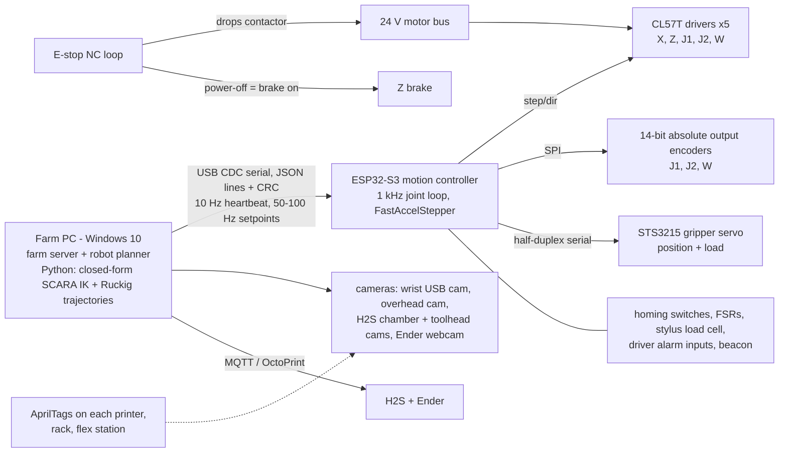

# FarmHand robot — architecture (Phase 1, Gate 1 draft, 2026-10-02)

Status: **Gate 1 draft. No CAD until Shawarma approves.** Station numbers marked *ASSUMED* are defaults
until Shawarma answers the questions at the end (table, printer layout, room, parts, plates, tools).
Research behind every claim: [RESEARCH.md](RESEARCH.md) and `docs/research/*.md`.
Numbers: [`design/phase1_torque_pass.py`](../design/phase1_torque_pass.py) → [`design/phase1_torque_pass.md`](../design/phase1_torque_pass.md).

## The pick: a SCARA arm on a Z column, riding a rail along the table front ("rail-SCARA")

**Plain English.** A SCARA (Selective Compliance Assembly Robot Arm) is an arm whose shoulder and elbow
joints turn about **vertical** axes, so the arm swings flat over the table like your forearm sweeping a
desk. Height comes from a separate vertical column (the **Z axis**: a ball screw lifting a carriage).
That column rides on a **linear rail** (a steel track with sliding carriages, the **X axis**) along the
front of the table, so the robot can park square in front of either printer, the plate rack, or the bin.

Why it matters: in a SCARA the weight of the payload pushes down on **bearings**, not on motors. Only the
Z screw lifts weight, and a ball screw plus a power-off brake holds it with the motor switched off.
Every other robot family we looked at holds the spool against gravity with a motor all day.

| Axis | What it does | Travel (first pass) | Drive | Motor | Position sensing | Gravity load on motor | Brake |
|---|---|---|---|---|---|---|---|
| **X** rail | slides the whole robot along the table front | ~1.3 m *ASSUMED* | HTD 5M belt, 20-tooth pulley, HGR20 rail | NEMA 23 closed-loop 3 N·m | motor encoder + homing switch + AprilTag re-reference per station | none (horizontal) | no |
| **Z** column | lifts the arm (bed height, plate rack, AMS on top) | ~0.95 m (v2 spool to AMS lid) | SFU1605 ball screw (5 mm lead) on HGR15 rail, 4040 column | NEMA 23 closed-loop **with 24 V power-off brake** | motor encoder + homing switch | **yes: 63 N, 11 % of capacity** | **yes** |
| **J1** shoulder | swings the arm in the horizontal plane | ±150° | 2-stage HTD belt 1:10 | NEMA 23 closed-loop | motor encoder + **14-bit absolute output encoder** | none (vertical axis) | no |
| **J2** elbow | second link | ±145° | belt 1:6 up the upper arm (motor sits at J1, keeps inertia low) | NEMA 23 closed-loop | motor encoder + 14-bit output encoder | none | no |
| **W** wrist yaw | turns the hand about a vertical axis | ±180° | belt 1:4 | NEMA 17 closed-loop | motor encoder + 14-bit output encoder | none | no |
| **G** gripper | self-centring parallel jaws | 0–100 mm stroke | rack + pinion on 2× MGN9 | Feetech STS3215 serial-bus servo (reports position + load) | servo's 12-bit encoder + FSR pads | none | no |

Link lengths (first pass, sized by the reach study below): upper arm **L1 = 300 mm**, forearm **L2 = 250 mm**,
hand to payload centre ~60 mm → **610 mm** max reach.

## Diagram

Top view of the station (*ASSUMED* defaults until measured: 1500 × 750 mm table, printers pushed to the
back wall, 100 mm gap, H2S on the left):

```
                                  back wall
  +--------------------------------------------------------------------------------+
  |  +-------------------+        +------------------+        +-----------------+  |
  |  |   Bambu H2S       |  100   |  Ender 3 S1 Pro  |        | plate rack (4)  |  |
  |  |   492 x 514       |  gap   |  455 x 490       |        +-----------------+  |
  |  |   AMS 2 Pro on top|        |  bed slides in Y |        | flex station    |  |
  |  |      [screen]     |        |    [screen]      |        |  -> parts chute |  |
  |  +==door (hinge ?)===+        +------------------+        +-------|bin|-----+  |
  |                                                                                |
  |   ======================= X rail (HGR20 on 2040 beam, ~1.3 m) ===============  | <- table front edge
  |            [Z column + SCARA carriage]  (parks clear of the door swing)        |
  +--------------------------------------------------------------------------------+
                                operator / room side
  front strip available for the rail: 750 - 514 = 236 mm (H2S), 260 mm (Ender)  (ASSUMED)
```

How the pieces talk (agrees with the robot contract in [ARCHITECTURE.md D7](ARCHITECTURE.md)):



## Why it won (the numbers that decided it)

Full table: [`design/phase1_torque_pass.md`](../design/phase1_torque_pass.md). Rules: hold ≤ 50 % of rating, move ≤ 70 %.

| | A fixed 6-axis between printers | B 6-axis on rail | C cartesian + telescoping fork | **D rail-SCARA (pick)** | E add-on kits + small arm |
|---|---|---|---|---|---|
| Worst gravity torque a **motor** holds | J2 23.5 N·m = **60 % of a 39 N·m strain wave: FAIL** | J2 14.6 N·m = 37 % (OK, but 3 braked joints) | Z only | **Z only: 0.05 N·m at the motor, brake holds it** | n/a |
| Worst moving load vs capacity | J2 78 % FAIL | J2 49 % | Y carriage moment 9.1 N·m on a telescoping slide | **J1 37 %, J2 23 %, W 44 %, Z 11 %, X 20 %** | n/a |
| Reach through the H2S door | needs 520–680 mm from an off-axis base | straight in | straight in | **straight in, wrist stays level** (lab plate-handler pattern) | no plate swap |
| Gravity joints needing a strain-wave gearbox + brake | 3 | 3 | 0 (Z brake) | **0 (Z brake only)** | 0 |
| Motion axes | 6 | 7 | 5 | **5 + gripper** | per printer |
| Weighted score (/5) | 2.35 | 3.05 | 3.30 | **4.25** | 3.10 |

Precedents that make D more than a guess:
- **Lab plate handlers are rail-mounted SCARAs.** The Brooks PreciseFlex PF400 / PF3400 move microplates into
  instruments through doors with a level wrist, ±90 µm, on optional 1–2 m rails; PF3400 limits collisions to
  < 100 N free space (grade C, `station_architectures.md` S10–S14).
- **Print farms run rail robots in production.** DHR Engineering serves 20–44 Bambu printers from a robot on a
  rail and added the H2D in under 24 h by swapping gripper jaws (grade B, S19).
- **No hobby 6-axis arm is shown holding 1.5 kg at 0.5 m.** PAROL6 documents 0.5 kg over its workspace,
  Thor 0.75 kg; AR4/Arctos claims are vendor-only (`open_arms.md`). A 6-axis that does it needs a C$500
  strain-wave shoulder plus brakes (`motion_hardware.md`).
- **SCARA inverse kinematics is closed-form** (two links in a plane + Z + yaw): a few lines of Python on the
  PC, no ROS 2 / MoveIt (which is unsupported on Windows 10 per `motion_hardware.md` §8).

**Runner-up: C, cartesian (rail + Z column + telescoping fork), 3.30.** It lost on stiffness and room: a
fork that reaches 450 mm into the H2S puts a 9.1 N·m moment on a telescoping slide (drawer-slide stages sag
several mm), and a rigid fork needs ~550 mm of clear space behind the column to retract, which is exactly
where the H2S door swings. It also can't follow the door's arc without coordinating three axes.
**B (6-axis on rail, 3.05)** was the most dexterous (it can tilt to scrape or face an angled screen) but
needs three braked gravity joints, two strain-wave gearboxes and 7 axes: about +C$1,200 and the hardest build.
**E (add-on kits, 3.10)** is the cheapest bridge, not a robot: FarmLoop-type kits (~US$235) flex the H2S plate
and push parts off with the toolhead, but nothing swaps plates on an H2S, and they do nothing for spools.

**What would kill the pick:** no room for a rail at the table front *and* no floor in front (then: a fixed
Z-column SCARA between the printers with ~730 mm reach, PF400-extended class, re-scored with Shawarma's
numbers), or an H2S door that must open toward the rail path with no parking spot clear of its swing.

## The jobs

**Rule for every entry into a printer (R8):** printer idle (`gcode_state` + `stg_cur`), bed < 35 °C,
toolhead parked, door state as expected, camera confirms, supervisor healthy → farm server issues a
5 s `permit` lease; controller re-checks it every step (contract D7).

| Job | Sequence (v1) | Estimate |
|---|---|---|
| **H2S plate swap** | farm server lowers the bed to a hand-off height (`gcode_line`, bed stops ~100 mm down by default) → X to H2S → open door → hand enters level, grips the plate's printed shoe → Z lifts the front edge ~8 mm off the magnets → pull 360 mm straight out → X to the flex station, drop the full plate in → take a clean plate from the rack → slide in, lower onto the rear locators, release, press-seat → out, close door, push at the magnet → door bit clear for 2 s → printer's own plate check (camera, offset, foreign object) is the pass/fail | **~90 s** (≤ 3 min target, R6), see below |
| **Ender plate swap** | OctoPrint brings the bed forward (`G1 Y` to the measured max) → grip the sheet's front tab → peel up → lift off (open frame) → seat the clean sheet against printed rear stops → OctoPrint re-probes the mesh | ~70 s |
| **Clear parts** | **Done offline, in parallel:** the full plate goes into a passive **flex station** that bends it over a curved guide as the robot pushes it through; parts pop off into a chute → bin. Wrist camera checks the plate is empty, then it goes to the rack as clean. The printer is already printing again. | while printing |
| **H2S door** | grip the handle, swing it along the hinge arc (the SCARA moves in that plane naturally) with current-limited compliance, park it open; close by pushing with the back of the hand at the magnet point | in the swap |
| **Screen tap** | fallback only (MQTT covers normal control): grounded conductive stylus on a spring plunger with a passive tilt, approaches the screen face | ~10 s |
| **v2: AMS 2 Pro restock** | hook opens the lid → spool tool (expanding mandrel into a printed hub plug on every spool) lifts the empty spool out → places the new one → feed the tip (open research item) → `ams_filament_setting` over MQTT | design for, build later |
| **v2: Ender filament** | **no robot threading.** Big 3–5 kg spools on a side stand cut swaps 2.5–4×; Klipper + Happy Hare multi-spool only if that is ever not enough | — |

Plate swap time estimate (motion speeds *ASSUMED* moderate; excludes the cool-down wait, which R8 gates at 35 °C):
checks 5 s · rail + Z 4 s · door 8 s · peel + pull 8 s · to flex station 6 s · drop in 6 s · pick clean 8 s ·
back 6 s · insert + seat 12 s · close door 8 s · verify 5 s ≈ **76–90 s**, + 20 s per reseat retry (max 2).

## End-effector concept: one hand, quick-change ready

From `end_effectors.md`: a tool changer with electrical pass-through costs 0.2–0.36 kg of the 0.3 kg the
spool case leaves, and pogo pins are the documented weak point, so **v1 is one multi-mode hand on a
kinematic flange** (3 hardened steel balls in 3 V-seats + a cam lock, the Jubilee pattern, ~40 µm), so a
spool tool bolts on in v2 without touching the arm.

The hand:
1. **Self-centring parallel jaws** (rack and pinion, both jaws move, part ends up centred), 0–100 mm stroke,
   swappable **TPU fin-ray pads** (soft ribs that wrap a shape) on rigid cores, plus a replaceable **steel
   "nail" edge** at each fingertip (fin-ray tips lose force on edges and thin plates).
2. **Plate grip:** every plate gets a printed **shoe** (a tab clipped/bonded at the front edge; the H2S plate
   already has a 136 × 15.5 mm front notch). The nails grip the shoe, so the robot always grabs the same feature.
3. **Capacitive stylus finger:** a phone-style (projected-capacitive) screen senses a finger because the
   finger is a **conductor tied to ground through your body**; it steals a little of the AC signal between the
   screen's row and column wires. Plastic is an insulator with no ground path, so nothing changes and the
   screen never sees it. Ours: 8–9 mm conductive foam/fabric tip, wired to ground, on a spring plunger
   preloaded > 1 N (so it also presses a resistive screen if the Ender's is resistive), load cell behind it.
4. **Hook** on the back of the hand for the door handle and the AMS lid.
5. **Sensing:** gripper servo load + FSR (force-sensing resistor) pads, stylus load cell, magnetic breakaway on
   the flange with a microswitch (collision), motor following-error on every axis.
6. **Wrist camera** on the flange side (not the tool) so hand-eye calibration survives tool swaps.

## Vision (R10)

- **Wrist camera** (USB, global shutter, eye-in-hand): final approach to AprilTags and handles, plate-empty
  check. **Overhead camera** sees the whole table. **Printer cameras**: H2S chamber + toolhead (the toolhead cam
  already checks plate seating), Ender webcam.
- **AprilTags** (printed square barcodes a camera can measure its exact position from) on each printer's
  front, the plate rack and the flex station → automatic re-calibration of the rail stations (rule D211).
- **Reuse the ESP32-S3 OV2640 camera?** Yes, as a fixed "bin / flex station" check camera (stop-and-look,
  Wi-Fi JPEG). Not as the wrist camera: rolling shutter blurs while moving, Wi-Fi on a moving arm drops, and
  hand-eye calibration wants a wired, stable stream. *(Reasoning, not a source.)*

## Accuracy and stiffness budget (first pass, plate seating ±1 mm, R5)

| Source | At 0.61 m reach | How it's controlled |
|---|---|---|
| J1/J2 motor encoder through 1:10 / 1:6 belts | ~0.1 mm per count | fine positioning |
| 14-bit output encoders | 0.23 mm per count | absolute reference + slip/drift fault (rule D205) |
| Encoder non-linearity | unknown (datasheets not fetched) | per-joint calibration table + AprilTag final approach |
| Column tilt under the arm's 14.4 N·m | 0.6 mm at plate height, 1.8 mm at AMS height (4040, assumed stiffness) | static and repeatable → calibrated per payload; stiffer column in Phase 2 if needed |
| X rail belt | ±0.3 mm *ASSUMED* | re-referenced to the AprilTag at each station |
| Plate seating | mechanical | ±2 mm float in the hand lets the plate find its locators; printer camera verifies |

## Safety concept (R8)

Speed- and force-limited robot instead of a full cage (cage added if Q3 says kids/pets):
hardwired NC E-stop drops the 24 V motor contactor and engages the Z brake (category 0); only the Z axis
can fall and its brake is power-off-applied; motor current caps keep tool force ≤ 50 N in the shared zone
(*ASSUMED* target, below the PF3400's 100 N); amber beacon + buzzer 3 s before any motion; robot enters a
printer only under the permit lease. Robot rows added to [SAFETY.md](SAFETY.md) (H17–H25).

## SP product angle

Nobody sells an H2S plate swapper (research: FarmLoop / 3DQue only flex in place; DHR is custom; Prusa AFS
is EUR 45k for its own printers). A rail-SCARA module that tends 2–4 Bambu H2-series printers and grows by
lengthening the rail is a real SP product lane. Phase 2 keeps it **original**: AR4 is non-commercial, PAROL6/OpenArm
are copyleft, so we copy ideas, never files.

## Questions for Shawarma (Gate 1)

1. The 6 station questions from the first message (table, printer layout, room, what you print, plates, tools).
2. **AMS 2 Pro: on top of the H2S, or beside it?** On top sets Z travel to ~0.95 m (spool to ~1 m high); beside cuts it to ~0.7 m.
3. **Which side is the H2S door hinged, and does it open past 90°?** Sets where the robot parks while the door is open.
4. **OK to add a printed shoe (tab) to each plate and printed rear stops on the Ender bed?** This is the key to reliable plate grabs.
5. **On arrival day (2026-10-03), 10 minutes with a phone and a luggage scale:** plate weight, door pull force, video of a plate coming off and going on, a ruler photo of the screen. List in `docs/research/printer_specifics.md` → "Measure on arrival day".
6. Budget: OK with the Phase-1 robot list in [BOM_draft.md](BOM_draft.md): **C$2,302** before tax
   (~C$2,650 with tax and shipping; most lines are estimates because shop pages were blocked)?
