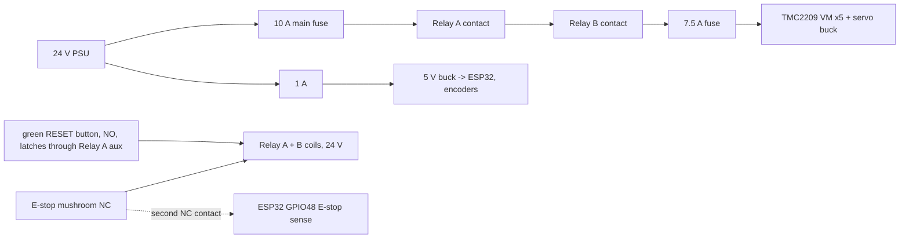

# FarmHand rail-SCARA v1 — wiring and power (lean BOM)

Plain-English key: **VM** = motor supply pin on a driver · **NC** = normally closed (circuit is complete
until you press it) · **SSI** = a 3-wire serial link the encoders use to report their angle · **I2C** =
2-wire bus for slow helper chips · **AWG** = American wire gauge (smaller number = thicker wire).

## Power budget

| Load | Voltage | Typical | Worst case | Note |
|---|---|---|---|---|
| 5 × NEMA 17 via TMC2209 | 24 V | ~0.6 A each from the supply while moving | 3.0 A total | TMC2209s draw much less from the supply than the 2 A coil current (they convert voltage to current) |
| STS3215 gripper servo | 12 V (buck) | 0.3 A | 2.8 A stall → 1.4 A from 24 V | the servo's "stall" is our grip force; cap its torque limit to 50 % in firmware |
| ESP32-S3 + 6 encoders + MCP23017 + ADS1115 + HX711 | 5 V / 3.3 V | 0.25 A | 0.4 A | fed from the ESP32 board's USB (PC side) **and** a 5 V buck, so position data survives an E-stop |
| Beacon + buzzer | 24 V | 0.1 A | 0.15 A | |
| **Total** | 24 V | **~4.5 A** | **~5 A (120 W)** | LRS-350-24 (14.6 A / 350 W) gives 3× margin; a cheaper 24 V 10 A unit is also fine |

**Wire and voltage drop (rule: < 3 %):** motor bus 18 AWG silicone, 2 m loop, 5 A:
2 × 2 m × 0.021 Ω/m × 5 A = 0.42 V = **1.8 %** ✓. Motor coil leads 22 AWG (2 A) inside cable chains.
Signal wires 26–28 AWG, shielded pair for the SSI clock/data running up the arm.

**Fuses (blade, on the 24 V side):** main 10 A · motor bus 7.5 A · 12 V servo branch 3 A · 5 V logic buck 1 A.

## E-stop chain (category 0: power to the motors is cut in hardware)

- Press E-stop → both relay coils drop → motor bus dead. **Two relays in series** so one welded contact can't keep power on.
- Twist-releasing the E-stop does **not** restart anything: the coils only re-latch when RESET is pressed (self-holding through Relay A's spare contact), then the firmware still needs a `reset` + re-home command (SAFETY.md H11).
- The Z axis can't fall: the T8×2 lead screw is self-locking (no brake needed). Every other joint swings in a horizontal plane.
- Logic stays powered, so the absolute encoders keep reporting position: no blind re-home sweep inside a printer.

## ESP32-S3 DevKitC-1 N16R8 pin map

GPIO 26–37 are taken by the module's flash/PSRAM, 19/20 are the USB link to the PC, and 0/3/45/46 are boot-strapping pins, so they're avoided.

| Signal | GPIO | Signal | GPIO |
|---|---|---|---|
| X STEP / DIR | 4 / 5 | Encoder SSI clock / data (shared) | 13 / 14 |
| Z STEP / DIR | 6 / 7 | Encoder CS: J1, J2, W, Z, X | 1, 2, 21, 38, 39 |
| J1 STEP / DIR | 15 / 16 | I2C SDA / SCL (MCP23017 + ADS1115) | 40 / 41 |
| J2 STEP / DIR | 17 / 18 | HX711 stylus load cell DOUT / SCK | 42 / 47 |
| W STEP / DIR | 8 / 9 | E-stop sense (second NC contact, pulled up) | 48 |
| Driver ENABLE (all, active low) | 10 | Gripper servo bus TX / RX (via bus board) | 43 / 44 |
| TMC2209 UART TX / RX (1 kΩ to one wire) | 11 / 12 | | |

- **TMC2209 addresses** (set by MS1/MS2 pins): X = 0, Z = 1, J1 = 2, J2 = 3 on the shared UART. W runs standalone (current set by its trim pot) because one UART bus only has 4 addresses.
- **MCP23017** (16 extra pins over I2C): 6 homing switches (X min/max, Z min/max, J1, J2), beacon, buzzer, breakaway microswitch, 7 spare.
- **ADS1115** (4-channel ADC over I2C): 2 × FSR grip pads, 24 V bus voltage divider (regen check, SAFETY.md H21), 1 spare.

## Cable routing (R14: hidden cabling)

X carriage ← 1.5 m cable chain from the controller box at the table end → up the Z column inside the V-slot channel → shoulder housing →
down the hollow J1 spigot (Ø20 bore) → inside the upper-arm beam → through the elbow (Ø14 forearm spigot bore) → inside the forearm →
through the wrist spigot (Ø10 bore) → hand. Bend radius ≥ 10 × cable diameter; leave a service loop at every joint (rule D208).
